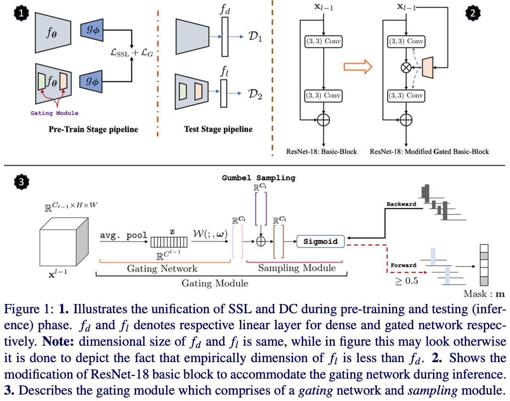
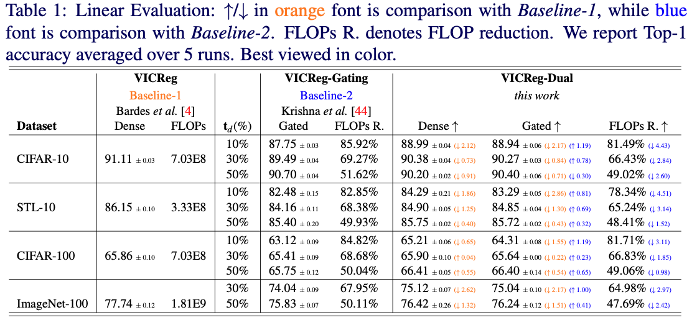
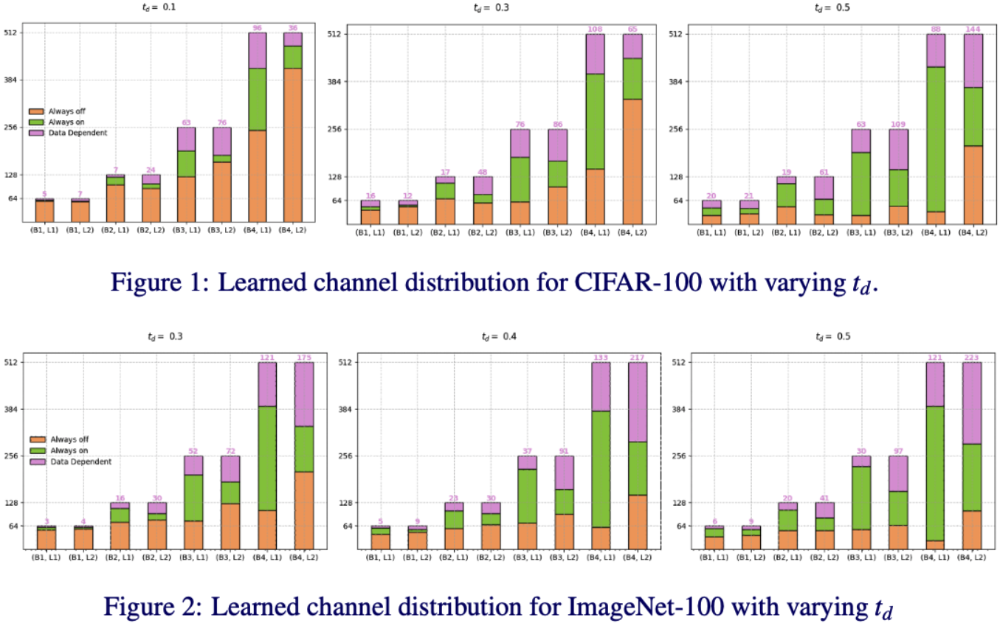

# Unifying Synergies between Self-supervised Learning and Dynamic Computation

This is an official Pytorch based implementation of [Unifying Synergies between Self-supervised Learning and Dynamic Computation](https://arxiv.org/pdf/2301.09164.pdf) accepted in [BMVC 2023](https://bmvc2023.org).

## Unification
In this work we present a novel perspective on the interplay between the SSL and DC paradigms. In particular, we show that it is feasible to simultaneously learn a dense and gated sub-network from scratch in an SSL setting without any additional fine-tuning or pruning steps. The co-evolution during pre-training of both dense and gated encoder offers a good accuracy-efficiency trade-off and therefore yields a generic and multi-purpose architecture for application-specific industrial settings. 



## Standard Results


### Quantitative 
Experimental results on across different data-set on various target budgets. We report Top-1 linear evaluation accuracy averaged over 5-runs.



### Qualitative
Learned channel distribution through  gating module.




## Getting Started 

### Requirements

The main requirements of this work are:

- Python 3.8  
- PyTorch 1.10.0
- pytorch-lightning 1.5.3
- Torchvision 0.11.1
- CUDA 10.2

We recommand using conda env to setup the experimental environments.

# Install other requirements
```shell script
pip install -r requirements.txt

# Clone repo
git clone https://github.com/KrishnaTarun/Unification.git
cd ./Unification
```

### Pre-Training

```shell script

cd bash_files/pretrain/

# ImageNet-100
cd imagent100/ 
bash vicreg_gating.sh

# CIFAR-100
cd cifar100/ 
bash vicreg_gating.sh

```
Like-wise rest of the model can be trained for other dataset as well.

### KNN-Evaluation 
```shell script
cd bash_files/knn/

# ImageNet-100
cd imagent100/
bash knn.sh

# CIFAR-100
cd cifar100/ 
bash knn.sh

```
###TODO citation bibtex

#### Please consider citing our paper if you find this work useful for your research.
 
 ```
 @inproceedings{Krishna_2023_BMVC,
  author = {Krishna, Tarun and Rai, Ayush K. and Drimbarean, Alexandru F and Arazo, Eric and Albert, Paul and Smeaton, Alan and McGuinness, Kevin and Connor, Noel O},
  title = {Unifying Synergies between Self-supervised Learning and Dynamic Computation},
  booktitle = {34th British Machine Vision Conference 2023, {BMVC} 2023, Aberdeen, UK, November 20-24, 2023},
  publisher = {BMVA},
  year = {2023},
}
 ```


